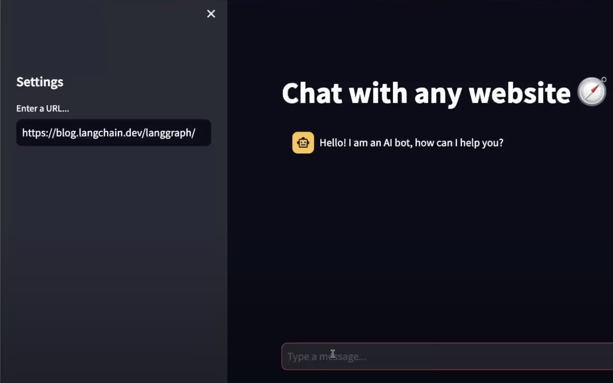

# Chat with any website 🤖
------------

This app harness the capabilities of LangChain and combines them with a Streamlit GUI to provide a chatbot capable of chatting with a website.

`Keywords:` Generative AI, LangChain, Retrieval Augmented Generation (RAG), Large Language Models (LLMs), Python, Streamlit



## Dependencies & Installation
------------

1. Clone this repository:
```bash
git clone [repository-link]
cd [repository-directory]
```

2. Install the necessary packages:
```bash
pip install -r requirements.txt
```

3. Create a .env file with the following variables:
```bash
OPENAI_API_KEY=[your-openai-api-key]
```

## Usage
------------
To launch the Streamlit app, execute the following command:
```bash
streamlit run app.py
```

## App Architecture
------------


